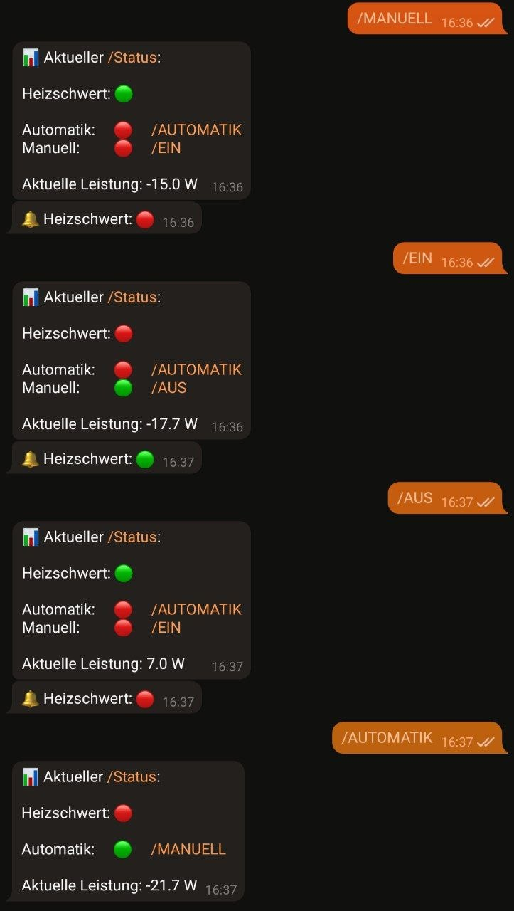

# Relais Switch (Heating Sword) for PV self-consumption optimization

Previously I "burned up" my overproduction with an electric air heater in the bathroom, see [this project](https://github.com/PaulusElektrus/AC_Dimmer).

Now I have integrated a Anker Battery Storage in my PV system and for summer it would be better to use the energy in the water heater so I decided to buy a heating sword. 😊

## Control Loop

I measure the household power every second.

- When the Battery is fully charged the overproduction from the PV is fed in the grid
- When for more than 10 seconds the power is <= -50 W (fed in) I switch on the heating sword globally for half an hour (~250 Wh)
    - Except there is for more than 10 seconds >= 50 W I switch off the heating sword because there is load in the household which the battery can not compensate
- When no overload event occured -> after half an hour the heating sword is turned off and waits for the system to be in overproduction again -> Cycle starts again

## Smart Meter

This project uses a [Shelly Pro 3EM Smart Meter](https://shelly-api-docs.shelly.cloud/gen2/Devices/Gen2/ShellyPro3EM) to measure the PV overproduction.

### Shelly API

To get the data from Shelly device simply use the rpc endpoint with a http client: `http://shelly_ip_address/rpc/EM.GetStatus?id=0`
You will get a response in json format.
This needs to be unpacked using the [Arduino JSON](https://github.com/bblanchon/ArduinoJson) Library to get the raw values.

## Microcontroller & other Hardware

An [ESP8266](https://www.espressif.com/sites/default/files/documentation/esp8266-technical_reference_en.pdf) fetches the data via WLAN.
The ESP8266 sends the measured power via serial interface to an Arduino Uno.
The [Arduino Uno](https://docs.arduino.cc/hardware/uno-rev3/) then controls a Relais which is connected to a 500 W heating sword in a water heater.

I used a [board which contains both Arduino & ESP8266](https://github.com/PaulusElektrus/Arduino_and_ESP) which I had used in other projects already.
The ESP does the networking stuff and the Arduino does the simple and therefore safe regulation task.  

## GUI

### Telegram Bot

I use a Telegram Bot to check the state and control the system:

Using this [Universal-Arduino-Telegram-Bot](https://github.com/witnessmenow/Universal-Arduino-Telegram-Bot) Library.